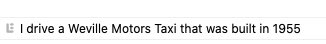
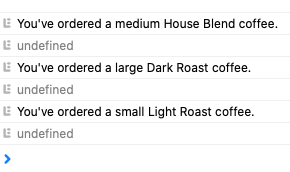
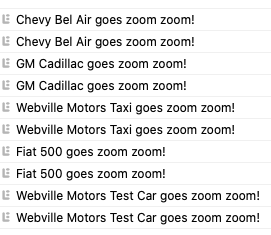
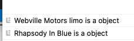
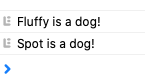
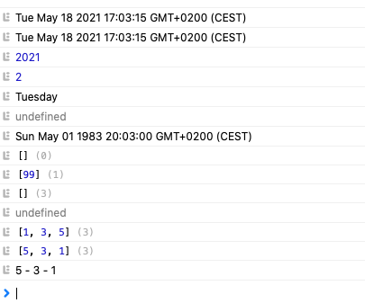

# object

From the Book Head First Javascript Chapter 12
_________________________________________________

object.html -> create an object with object literals

_________________________________________________

dog.html -> create an object with object literals

_________________________________________________

coffee.html -> Contructors with methods

_________________________________________________

cars.html -> Contructors with object literal

_________________________________________________

carDog.html -> Combined code to see results

_________________________________________________

dogCatcher.html -> More code

_________________________________________________

JSconst.html -> playing with built in JS functions/objects

